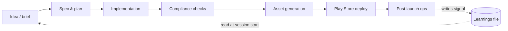

# claude-code-mobile-kit

A reference kit for shipping Flutter mobile apps to the Google Play Store using a multi-agent Claude Code workflow. It codifies a pattern that takes an indie app from idea → spec → implementation → compliance → asset generation → deployment → maintenance, with most of the heavy lifting handled by role-specific subagents, automated hooks, and slash commands.

This isn't a framework like Django. It's a **playbook + reference templates + working patterns** you can fork into your own setup.

---

## Who this is for

Indie Flutter developers who:
- Already use Claude Code (or are about to)
- Ship — or want to ship — apps to Google Play
- Want the boring lifecycle stuff (compliance pages, image assets, version bumps, Play Console submissions, analytics event sync) handled by agents instead of by hand
- Are comfortable with the command line, with `gh` / `git`, and with reading + adapting Markdown templates

**Not for:** non-coders, web devs who don't ship native, anyone looking for a polished GUI tool, or anyone expecting a no-config experience.

---

## What you get

```
claude-code-mobile-kit/
├── README.md              ← you are here
├── METHODOLOGY.md         ← the philosophy: why agents, when this pattern works (and when it doesn't)
├── docs/
│   ├── 01-overview.md         ← workflow phases + diagrams
│   ├── 02-setup.md            ← prerequisites + first run
│   ├── 03-subagents.md        ← the subagent roles and when each fires
│   ├── 04-hooks.md            ← PostToolUse hooks and what they're for
│   ├── 05-slash-commands.md   ← custom slash commands that wrap multi-step flows
│   ├── 06-deploying.md        ← Play Console API automation patterns
│   ├── 07-maintenance.md      ← post-launch ops (analytics, policy regen, version bumps)
│   └── 08-self-improving.md   ← the auto-improvement loop (learnings file + hook patterns)
└── templates/
    ├── CLAUDE.md          ← root CLAUDE.md template for a new Flutter app
    ├── agents/            ← subagent definitions (architect, compliance-checker, etc.)
    ├── hooks/             ← PostToolUse hook scripts
    ├── slash-commands/    ← custom slash command definitions
    └── scripts/           ← Play Console / analytics / keystore helpers
```

The methodology and the diagrams are the conceptual contribution. The templates are the copy-paste starter that saves you 10-20 hours of trial and error.

---

## Quick start

1. **Prerequisites** (see [docs/02-setup.md](docs/02-setup.md) for details):
   - Flutter SDK installed and `flutter doctor` happy
   - Claude Code installed and authenticated
   - A Google Play Developer account ($25 one-time fee, paid directly to Google)
   - `gh` and `git` set up
   - A Flutter project (existing or fresh)

2. **Clone the kit:**

   ```bash
   git clone https://github.com/prash5t/claude-code-mobile-kit.git
   cd claude-code-mobile-kit
   ```

3. **Copy templates into your Flutter project:**

   ```bash
   cp templates/CLAUDE.md /path/to/your-flutter-app/CLAUDE.md
   cp -r templates/agents /path/to/your-flutter-app/.claude/
   cp -r templates/hooks /path/to/your-flutter-app/.claude/
   cp -r templates/slash-commands /path/to/your-flutter-app/.claude/
   ```

4. **Edit `CLAUDE.md`** to fill in your app's specifics (name, package ID, monetization model, etc.).

5. **Open the project in Claude Code** and try the first slash command, e.g. `/scaffold-feature` or `/policy-sync`.

Full setup walkthrough in [docs/02-setup.md](docs/02-setup.md).

---

## Workflow at a glance



Each phase is owned by one or more role-specific subagents. Most transitions are triggered by slash commands. PostToolUse hooks keep the workspace coherent (analytics events stay synced, policy pages get regenerated when relevant code changes, etc.).

Full diagram set in [docs/01-overview.md](docs/01-overview.md).

---

## What makes this different

Most agentic-dev content out there is general-purpose web/backend automation. This kit is **specifically for mobile, specifically for Flutter, specifically for solo or small-team indie shipping**. The constraints make the patterns sharper:

- Mobile apps have a hard "ship to store" gate (Play Console review). The compliance-checker subagent is built for that gate.
- Indie shippers don't have a designer or a release engineer. The asset-generator and deployer subagents fill those roles.
- A single dev can't be in every code path. The PostToolUse hooks keep the analytics catalog, policy pages, and version metadata coherent without manual checks.
- Self-improvement matters because no one's writing tickets for you. The kit includes a learnings-file pattern so the workflow accumulates context across sessions.

---

## Maintenance posture

**This is a reference repo, not an actively maintained framework.** Fork freely, use as-is, or submit improvements. I'll review PRs when I have time but make no guarantees on response. If you build something useful on top of this, please open an issue with a link — I'd love to see it.

The patterns here are extracted from a personal workflow I use to semi-automate a collection of indie Flutter apps I ship in my spare time. The workflow takes minimal manual input and handles idea refinement, implementation, compliance, image generation, Play Store deployment, and ongoing maintenance — with most of the work delegated to subagents and hooks. This kit is what's reusable from that setup, sanitized and templated for general use.

---

## Honest caveats

- **Claude Code dependent.** The whole kit assumes you're using Claude Code as your agent runtime. Other tools (Cursor, Aider, Continue) have similar concepts but the templates won't drop in without adaptation.
- **Anthropic API costs apply.** Running agents costs tokens. Budget accordingly. A typical indie app shipping cycle through this workflow runs USD 5-30 in Claude usage depending on scope and how often you re-run things.
- **Play Console rules change.** The compliance-checker subagent encodes patterns that work as of the kit's last update. Play Store policy moves. Always read the actual current policy.
- **Not a no-code tool.** You will need to read code, edit YAML / Markdown, run CLI commands. If you've never opened a terminal, this isn't your starting point.
- **No guarantees about Google Play acceptance.** Following the kit's compliance patterns reduces friction but doesn't eliminate rejection. The Play Console team has final say.

---

## License

MIT. See [LICENSE](LICENSE).

## Author

Built by [Prashant Ghimire](https://ghimireprashant.com.np). See more at [github.com/prash5t](https://github.com/prash5t).
