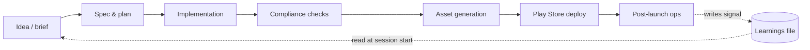

# claude-code-mobile-kit

A working setup for shipping Flutter apps to the Google Play Store with a multi-agent Claude Code workflow. Takes an indie app from idea → spec → implementation → compliance → asset generation → deployment → maintenance, with most of the lifecycle work delegated to role-specific subagents, automated hooks, and slash commands.

You clone it, run `bootstrap.sh` against your Flutter project, fill in `CLAUDE.md`, and start using slash commands.

---

## Five-minute start

```bash
git clone https://github.com/prash5t/claude-code-mobile-kit.git
cd claude-code-mobile-kit
./scripts/check-prereqs.sh
./scripts/bootstrap.sh /path/to/your-flutter-app
cd /path/to/your-flutter-app
$EDITOR CLAUDE.md          # fill in your app details
claude                      # launches Claude Code
```

Then in the Claude Code session:

```
/policy-sync               # safe first slash command — regenerates docs/policy/
```

Full quickstart with options: [QUICKSTART.md](QUICKSTART.md).

---

## Who this is for

Flutter indie developers who:
- Already use Claude Code (or are about to)
- Ship — or want to ship — apps to Google Play
- Want the boring lifecycle stuff (compliance pages, image assets, version bumps, Play Console submissions, analytics catalog sync) handled by agents instead of by hand
- Are comfortable with the command line, with `git`, and with reading and adapting Markdown templates

Not for: non-coders, web devs who don't ship native apps, anyone looking for a polished GUI tool, or anyone expecting a no-config experience.

---

## See it before you adopt it

The [example/](example/) directory shows what a populated workspace looks like after a few weeks of using the kit. The fictional app, "DailyStreak," demonstrates:

- A filled-in [CLAUDE.md](example/CLAUDE.md)
- An architect-generated [feature spec](example/docs/spec/daily-streak-widget.md)
- An accumulated [learnings.md](example/docs/learnings.md) with rules subagents will honor on the next run
- An auto-synced [analytics events catalog](example/docs/analytics-events.md)
- A [generated privacy policy](example/docs/policy/privacy-policy.md)
- A [release history](example/docs/release-history.md)
- A [store listing](example/docs/store-listing.md)

Reading the example is the fastest way to grok what the kit produces.

---

## What's in the repo

```
claude-code-mobile-kit/
├── README.md                  ← you are here
├── QUICKSTART.md              ← 5-min path from clone to first slash command
├── METHODOLOGY.md             ← philosophy and trade-offs
├── scripts/
│   ├── check-prereqs.sh       ← verify Flutter / Claude Code / git / python3 are installed
│   └── bootstrap.sh           ← one-command setup into a target Flutter project
├── docs/
│   ├── 01-overview.md         ← workflow phases + diagrams
│   ├── 02-setup.md            ← detailed setup walkthrough
│   ├── 03-subagents.md        ← the subagent roles
│   ├── 04-hooks.md            ← PostToolUse hooks
│   ├── 05-slash-commands.md   ← slash commands that wrap multi-step flows
│   ├── 06-deploying.md        ← Play Console API integration
│   ├── 07-maintenance.md      ← post-launch ops
│   └── 08-self-improving.md   ← the auto-improvement loop
├── templates/                 ← copied into your project by bootstrap.sh
│   ├── CLAUDE.md              ← root template for a new Flutter app
│   ├── agents/                ← 7 subagent definitions
│   ├── hooks/                 ← 4 PostToolUse hook scripts
│   ├── slash-commands/        ← 9 slash command definitions
│   ├── scripts/               ← Python helpers for Play Console API
│   └── .claude-settings.json  ← hook registration config
└── example/                   ← populated reference workspace (read-only browse)
    ├── CLAUDE.md
    └── docs/
        ├── spec/
        ├── policy/
        ├── learnings.md
        ├── analytics-events.md
        ├── release-history.md
        └── store-listing.md
```

---

## Workflow at a glance



Each phase is owned by one or more role-specific subagents. Most transitions are triggered by slash commands. PostToolUse hooks keep the workspace coherent (analytics events stay synced, policy pages get regenerated when relevant code changes, etc.).

Full diagram set in [docs/01-overview.md](docs/01-overview.md).

---

## Slash commands you'll use

- `/new-feature <brief>` — refine an idea into a spec
- `/implement <spec-name>` — build from an approved spec
- `/compliance-check` — Play Store policy audit
- `/configure <integration>` — wire firebase, admob, mixpanel, etc.
- `/refresh-assets` — regenerate icon, feature graphic, screenshots
- `/publish <bump> <track>` — bump version, build AAB, upload to Play
- `/promote <from>-to-<to>` — move releases between tracks
- `/check-health` — post-launch audit
- `/policy-sync` — regenerate privacy policy and terms

Full reference: [docs/05-slash-commands.md](docs/05-slash-commands.md).

---

## What makes this different from a generic agentic-dev setup

Most agentic-dev content out there is general-purpose web/backend automation. This kit is for mobile, Flutter, solo or small-team indie shipping. The constraints make the patterns sharper:

- Mobile apps have a hard "ship to store" gate (Play Console review). The compliance-checker subagent is built for that gate.
- Indie shippers don't have a designer or a release engineer. The asset-generator and deployer subagents fill those roles.
- A single developer can't be in every code path. The PostToolUse hooks keep the analytics catalog, policy pages, and version metadata coherent without manual checks.
- Self-improvement matters because no one's writing tickets for you. The kit includes a learnings-file pattern so the workflow accumulates context across sessions. See [docs/08-self-improving.md](docs/08-self-improving.md).

---

## Maintenance posture

This is a reference repo, not an actively maintained framework. Fork freely, use as-is, or submit improvements. PRs are reviewed when there's time; no SLA. If you build something useful on top of this, please open an issue with a link — I'd like to see it.

The patterns here are extracted from a personal workflow used to semi-automate a collection of indie Flutter apps shipped in free time. The workflow takes minimal manual input and handles idea refinement, implementation, compliance, image generation, Play Store deployment, and ongoing maintenance — with most of the work delegated to subagents and hooks. This kit is what's reusable from that setup, sanitized and templated for general use.

---

## Honest caveats

- **Claude Code dependent.** The whole kit assumes Claude Code as the agent runtime. Other tools (Cursor, Aider, Continue) have similar concepts, but the templates won't drop in without adaptation.
- **Anthropic API costs apply.** Running agents costs tokens. Budget accordingly. A typical indie app shipping cycle through this workflow runs USD 5-30 in Claude usage depending on scope.
- **Play Console rules change.** The compliance-checker encodes patterns that work as of the kit's last update. Play Store policy moves. Always read the current policy.
- **Not a no-code tool.** You will read code, edit YAML and Markdown, run CLI commands.
- **No guarantees about Google Play acceptance.** Following the kit's compliance patterns reduces friction but doesn't eliminate rejection. The Play Console team has final say.

---

## License

MIT. See [LICENSE](LICENSE).

## Author

Built by [Prashant Ghimire](https://ghimireprashant.com.np). See more at [github.com/prash5t](https://github.com/prash5t).
