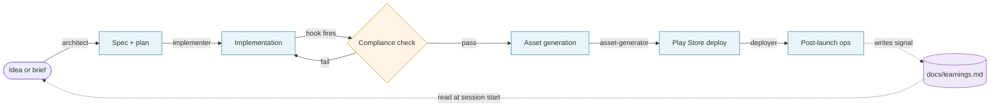
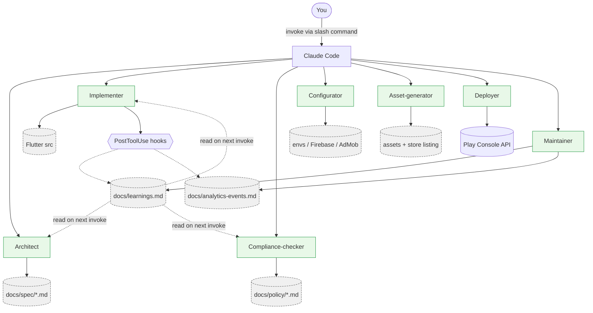
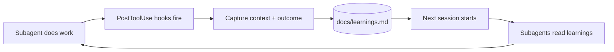

# 01 — Workflow overview

This doc gives you the mental model. Read it once. The rest of the docs (subagents, hooks, slash commands) make a lot more sense after this.

---

## The seven phases

Every app moves through these phases, sometimes multiple times:

| Phase | Owner subagent(s) | Triggers |
|---|---|---|
| 1. Idea | architect | You type a brief into a slash command or open a session |
| 2. Spec & plan | architect | Architect refines idea into spec docs |
| 3. Implementation | implementer | You approve the spec; implementer writes code |
| 4. Compliance | compliance-checker | Hook fires on relevant code edits; or explicit pre-release check |
| 5. Asset generation | asset-generator | Pre-release; or when store listing needs refresh |
| 6. Play Store deploy | deployer | You run `/publish` after compliance + assets pass |
| 7. Maintenance | maintainer | Hooks fire on regular events (crash report, analytics drift, etc.) |

Plus an always-on self-improvement layer:
- All subagents read `docs/learnings.md` before acting
- All subagents (or hooks) append to `docs/learnings.md` after significant actions

---

## Workflow diagram (high level)



---

## Subagent topology diagram



---

## The self-improvement loop



Mechanism is plumbing, not magic. See [METHODOLOGY.md](../METHODOLOGY.md#how-the-self-improving-angle-actually-works-sober-version) for the honest version.

---

## Where each phase's outputs live

The kit assumes a folder layout in your Flutter project. The templates create most of this:

```
your-flutter-app/
├── CLAUDE.md                ← master agent prompt (root)
├── pubspec.yaml             ← managed normally
├── lib/                     ← Flutter source (implementer writes here)
├── android/, ios/           ← platform stuff
├── assets/                  ← icon, store assets (asset-generator writes here)
├── .claude/
│   ├── agents/              ← per-role subagent definitions
│   ├── hooks/               ← PostToolUse hook scripts
│   └── slash-commands/      ← /scaffold-feature, /policy-sync, /publish, etc.
└── docs/
    ├── spec/                ← architect-generated feature specs
    ├── policy/              ← privacy policy, terms of use (compliance-generated)
    ├── store-listing.md     ← Play Console listing copy
    ├── analytics-events.md  ← canonical event catalog (auto-synced)
    ├── release-history.md   ← version log (hook-maintained)
    └── learnings.md         ← cross-session memory (auto-appended)
```

Every file path you'll see referenced in templates assumes this layout.

---

## A typical session: from idea to shipped

Here's what a real cycle looks like end-to-end. Times are rough; your mileage will vary.

| Step | Time | What you do | What the workflow does |
|---|---|---|---|
| 1. Idea | 5 min | Type a brief into `/new-feature` slash command | Architect refines it into `docs/spec/<feature>.md`, asks clarifying Qs |
| 2. Approve spec | 5 min | Read spec, edit if needed | (waiting for you) |
| 3. Implement | 10-60 min | `/implement <feature>` and watch | Implementer writes code, runs format/analyze, writes tests if applicable |
| 4. Compliance | 1-2 min | (auto-fires) | Compliance-checker scans the change, flags policy implications, updates `docs/policy/` if needed |
| 5. Asset refresh | 5-15 min | `/refresh-assets` before release | Asset-generator updates icon/screenshots/feature graphic per current screens |
| 6. Submit | 5 min | `/publish minor` (or major/patch) | Deployer bumps version, builds AAB, uploads to Play Console internal track, drafts release notes |
| 7. Promote | (Play review wait) | Wait for Google review, then `/promote internal-to-production` | Deployer moves the release through tracks |
| 8. Post-launch | ongoing | Just check in occasionally | Maintainer notes crashes/analytics drift in `learnings.md`, suggests fixes next session |

A confident user with the kit set up can ship a small feature in **20-60 minutes from idea to internal-track AAB**. Big features take longer because thinking takes longer, not because the tooling slows down.

---

## What you'll find in the next docs

- **[02-setup.md](02-setup.md)** — install, configure, and run your first slash command
- **[03-subagents.md](03-subagents.md)** — the role of each subagent, when to invoke, and how to extend
- **[04-hooks.md](04-hooks.md)** — PostToolUse hooks pattern with concrete examples
- **[05-slash-commands.md](05-slash-commands.md)** — the slash commands the kit provides and how to write your own
- **[06-deploying.md](06-deploying.md)** — Play Console API integration patterns
- **[07-maintenance.md](07-maintenance.md)** — post-launch ops
- **[08-self-improving.md](08-self-improving.md)** — the learnings file pattern in depth
