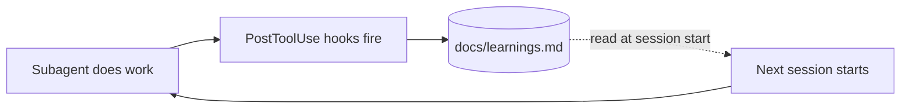

# 08 — The self-improving workflow

If you've read [METHODOLOGY.md](../METHODOLOGY.md#how-the-self-improving-angle-actually-works-sober-version), you already know there's no magic here. "Self-improving" means the workflow's behavior measurably gets better over weeks of use, and the mechanism is plumbing: durable state in Markdown files that subagents read before acting and write to after.

This doc explains the plumbing.

---

## The three components



1. **The `docs/learnings.md` file** — a single Markdown file at a known path that all subagents read before acting and write to when they observe something worth remembering.

2. **PostToolUse hooks** — small shell scripts that fire after specific tool calls and append structured entries to `docs/learnings.md` without needing the developer to remember.

3. **The "read learnings first" rule in every subagent system prompt** — every subagent template includes a step at the top of its instructions: "Before acting, read `docs/learnings.md` and consider any entries relevant to this task."

That's it. Three small disciplines, compounding effect.

---

## Anatomy of `docs/learnings.md`

The file grows over time. Format isn't strict, but the kit's templates use a date-stamped entry pattern:

```markdown
# Learnings

> Cross-session memory for this app's agentic workflow. Append newest at the top.

---

## 2026-05-17 — Compliance: AdMob banner placement
Banner inside ScrollView triggered policy notice in Play Console for v1.2.0.
Moved to fixed bottom bar in v1.2.1. Notice cleared.
**Rule going forward:** never place banner inside scrollable content.
**Source:** /compliance-check on 2026-05-17, captured by capture-learning.sh

## 2026-05-15 — Implementation: Empty-state crash
HomeScreen._loadData crashed when streak history was empty (NullPointerException).
Fixed by adding explicit empty-state branch.
**Rule going forward:** always handle the empty path explicitly in new widgets.
**Source:** /implement empty-state-fix on 2026-05-15

## 2026-05-13 — Architect: Don't re-pitch features the user rejected
User rejected "social sharing" idea twice (privacy concerns).
Don't suggest social sharing again unless user explicitly raises it.
**Source:** /new-feature session 2026-05-13
```

Three things make this useful:

- **Sortable.** Newest entries at the top so the first thing subagents see is most-recent context.
- **Rule-stated.** Each entry distills to a single rule the workflow should honor.
- **Sourced.** Every entry says where it came from so you can re-investigate if needed.

---

## How subagents use learnings

Every subagent template starts with words like:

```
Before responding, read docs/learnings.md.
Look for entries relevant to <this subagent's domain>.
Apply any rules stated there to your work.
```

In practice this means:

- **Architect** filters its suggestions by the rules in learnings ("user said no social sharing → don't re-suggest")
- **Implementer** checks for known anti-patterns before writing code ("never place AdMob banner in scrollable content")
- **Compliance-checker** specifically scans for issues that learnings have flagged before
- **Deployer** notes operational rules ("Play review takes 1-3h this week; plan accordingly")
- **Maintainer** uses learnings as the basis for its weekly health summary

You don't have to ask subagents to do this. The behavior is baked into the templates.

---

## How learnings get written

Three sources:

### 1. Hook-captured (automatic)

The `capture-learning.sh` hook fires after significant events (a deploy succeeds, a compliance check flags something, an analytics-event renames). It appends a structured entry without asking the developer.

Example: after `/publish` finishes successfully and produces release notes, the hook appends:

```markdown
## 2026-05-17 — Released v1.3.0
Notes: Added daily-streak widget; fixed empty-state crash.
Internal track upload succeeded. Awaiting Play review.
**Source:** /publish minor on 2026-05-17
```

### 2. Subagent-captured (semi-automatic)

When a subagent observes something noteworthy mid-task, it explicitly writes to learnings. For example, the architect appending:

```markdown
## 2026-05-17 — Architect: User clarification on streaks
User wants streaks to reset at midnight in user's local time zone (not UTC).
This is the second time this came up; codifying.
**Source:** /new-feature daily-streak-widget on 2026-05-17
```

### 3. Manual (developer-initiated)

You can edit `docs/learnings.md` directly anytime. Common cases:
- Adding rules you've learned from sources outside the workflow (a Twitter thread, a Play Console email)
- Sanitizing or deleting entries that are no longer accurate
- Distilling multiple related entries into a single broader rule

---

## Keeping the file from sprawling

Over time, `docs/learnings.md` will grow. The kit's templates include a `/distill-learnings` slash command that takes the file and:

1. Identifies redundant or superseded entries
2. Merges related entries into broader rules
3. Archives the original entries to `docs/learnings-archive.md` for reference
4. Produces a shorter, cleaner `docs/learnings.md`

Run quarterly, or whenever the file feels unmanageable.

---

## Anti-patterns

**Treating learnings as a project log.** It's not "here's everything that happened." It's "here are rules to apply." A learning entry without an actionable rule is just journaling.

**Letting learnings reference specific deleted code.** "The fix in `lib/foo.dart` line 42…" becomes meaningless after a refactor. Phrase rules abstractly: "When implementing X-like screens, do Y."

**Manually adding learnings the workflow should infer.** If you find yourself writing "remember to do X" entries manually, that's a signal you should add a hook or a subagent rule to capture X automatically.

**Letting learnings file grow into the megabytes.** Run `/distill-learnings` regularly. A subagent reading a 500KB learnings file at the start of every task is slow and expensive.

---

## How the "self-improvement" claim plays out in practice

After 2-3 weeks of using the kit:

- The architect stops suggesting features you keep rejecting
- The compliance-checker catches recurring policy issues before submission
- The implementer avoids known anti-patterns without prompting
- The deployer schedules its work around known Play Console review times
- New session start-up cost is shorter because the learnings file front-loads context

The improvement is measurable. The mechanism is just: durable text files + agents that read them. No model fine-tuning, no fancy memory architectures, no agent-modifying-itself.

That's what "self-improving" actually means in this kit.
